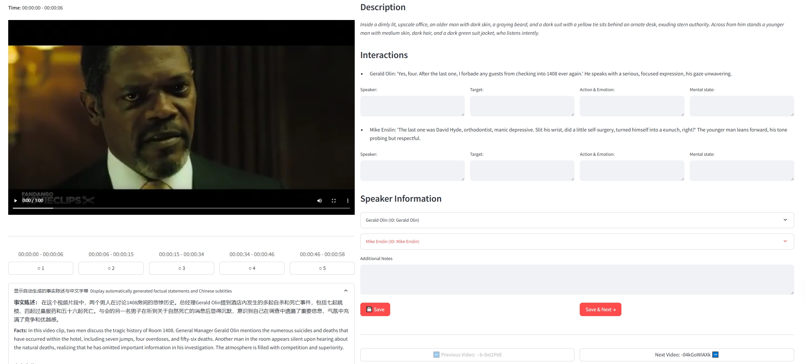

# Video Scene Annotation Tool

A Streamlit-based video scene annotation tool that supports local and cloud storage video scene annotation.

## System Requirements

- Python 3.10 or higher
- pip or conda package manager

## Installation Steps

1. Create and activate a virtual environment (recommended):

```bash
# Using conda
conda create -n video_scene python=3.10
conda activate video_scene

# Or using venv
python -m venv video_scene
# Windows
.\video_scene\Scripts\activate
# Linux/Mac
source video_scene/bin/activate
```

2. Install dependencies:

```bash
pip install -r requirements.txt
```

## Running the Application

```bash
cd src
streamlit run app.py
```

The application will automatically open in your browser at: http://localhost:8501

## Usage Guide

1. On first run, select video access mode:
   - Local Video Mode: Load video files from local disk
   - Cloud Storage Mode: Load videos from cloud storage (e.g., Google Drive)

2. Local Video Mode Configuration:
   - Set video directory path
   - Set script directory path

3. Cloud Storage Mode Configuration:
   - Set remote video folder URL
   - Supports Google Drive and other cloud storage services

4. Annotation Features:
   - Scene description verification
   - Interactive content annotation
   - Speaker mapping confirmation
   - Add notes and feedback

## Keyboard Shortcuts

- Spacebar: Play/Pause video
- D key: Next scene

## Troubleshooting

1. If you encounter "No module named 'streamlit'":
   ```bash
   pip install streamlit
   ```

2. If video cannot be played:
   - Check if video file path is correct
   - Ensure video format is MP4
   - For cloud storage mode, verify access permissions

3. If page loads slowly:
   - Check network connection
   - Consider using local video mode
   - Reduce video file size

## Project Structure

```
video_scene_verifier/
├── src/
│   └── app.py          # Main application
├── config/             # Configuration files
└── requirements.txt    # Dependency list
```

## Feedback and Support

If you encounter issues or need help:
1. Verify all dependencies are correctly installed
2. Confirm Python version meets requirements
3. Check console error messages

## Release Notes

- Version: 1.0.0
- Last Updated: [Current Date]
- Supported Platforms: Windows, macOS, Linux 

## 推理过程说明

本项目通过整合 `open_ended_answer`、正确的多选答案、`modality_evidence` 和 `mental_state_evidence`，模拟了内部的心理理论（Theory of Mind, ToM）推理轨迹。这反映了一个角色如何整合多模态线索和社交推理来进行心理状态归因。

具体而言，推理过程包括：
1. 分析多模态证据（如面部表情、语气、肢体语言）
2. 结合角色的内部独白和思考过程
3. 基于上下文推断角色的心理状态
4. 生成开放性解释，阐述推理逻辑

这种方法不仅关注最终答案，更重视推理的过程和深度，体现了社交认知的复杂性。

## 数据集说明

### 原始视频数据集

本项目的原始视频来自于 **Social-IQ 2.0** 数据集，这是一个由卡内基梅隆大学多模态计算实验室（MultiComp Lab）创建的社交智能数据集。数据集包含超过1,000个视频，涵盖了社交互动的丰富场景。

### 视频下载方法

#### 方法一：使用Social-IQ官方下载脚本

1. 克隆Social-IQ数据集仓库：
```bash
git clone https://github.com/cmu-multicomp-lab/social-iq-2.0.git
cd social-iq-2.0
```

2. 创建并激活conda环境：
```bash
conda create -n siq2 python=3.8 -y
conda activate siq2
pip install -r requirements.txt
```

3. 安装ffmpeg（根据您的操作系统选择适当的命令）：
```bash
# Ubuntu/Debian
sudo apt update && sudo apt install ffmpeg

# macOS (使用Homebrew)
brew install ffmpeg

# Windows (使用Chocolatey)
choco install ffmpeg
```

4. 下载数据集：
```bash
python siq2/download_all.py
```

#### 方法二：使用本项目提供的直接下载链接

我们在项目的 `config/video_links.json` 中提供了直接的视频下载链接。您可以使用以下脚本下载：

```bash
python scripts/download_videos.py
```

### 视频筛选

使用本项目提供的JSON文件，可以根据video ID精确筛选所需的视频。具体筛选方法请参考 `scripts/filter_videos.py` 脚本。

## 发布说明

- 版本：1.0.0
- 最后更新：[当前日期]
- 支持平台：Windows、macOS、Linux 

## Tool Screenshot

