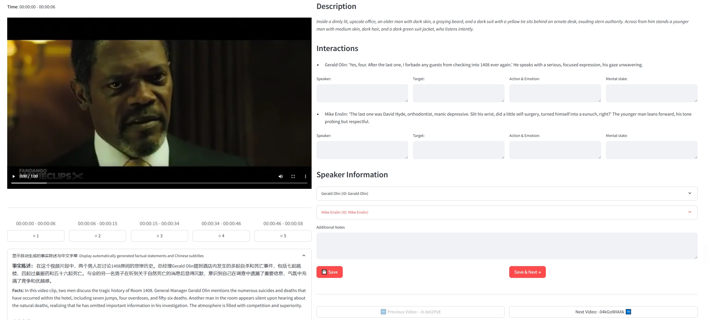

# Video Scene Annotation Tool

A Streamlit-based video scene annotation tool that supports local and cloud storage video scene annotation.

## System Requirements

- Python 3.10 or higher
- pip or conda package manager

## Installation Steps

1. Create and activate a virtual environment (recommended):

```bash
# Using conda
conda create -n video_scene python=3.10
conda activate video_scene

# Or using venv
python -m venv video_scene
# Windows
.\video_scene\Scripts\activate
# Linux/Mac
source video_scene/bin/activate
```

2. Install dependencies:

```bash
pip install -r requirements.txt
```

## Running the Application

```bash
cd src
streamlit run app.py
```

The application will automatically open in your browser at: http://localhost:8501

## Usage Guide

### Basic Configuration

1. On first run, select video access mode:
   - Local Video Mode: Load video files from local disk
   - Cloud Storage Mode: Load videos from cloud storage (e.g., Google Drive)

2. Local Video Mode Configuration:
   - Set video directory path
   - Set script directory path

3. Cloud Storage Mode Configuration:
   - Set remote video folder URL
   - Supports Google Drive and other cloud storage services

### Annotation Features

1. Scene Description Verification
   - Check and confirm accuracy of each scene description
   - Mark scene start and end times

2. Interactive Content Annotation
   - Record dialogue content in scenes
   - Annotate important visual cues

3. Speaker Mapping Confirmation
   - Identify and record speakers in scenes
   - Confirm speaker-dialogue correspondence

4. Notes and Feedback
   - Add scene-related notes
   - Record annotation issues or suggestions

### Keyboard Shortcuts

- Spacebar: Play/Pause video
- D key: Next scene

## Project Structure

```
video_scene_verifier/
├── src/
│   └── app.py          # Main application
├── config/             # Configuration files
└── requirements.txt    # Dependency list
```

## Tool Preview

